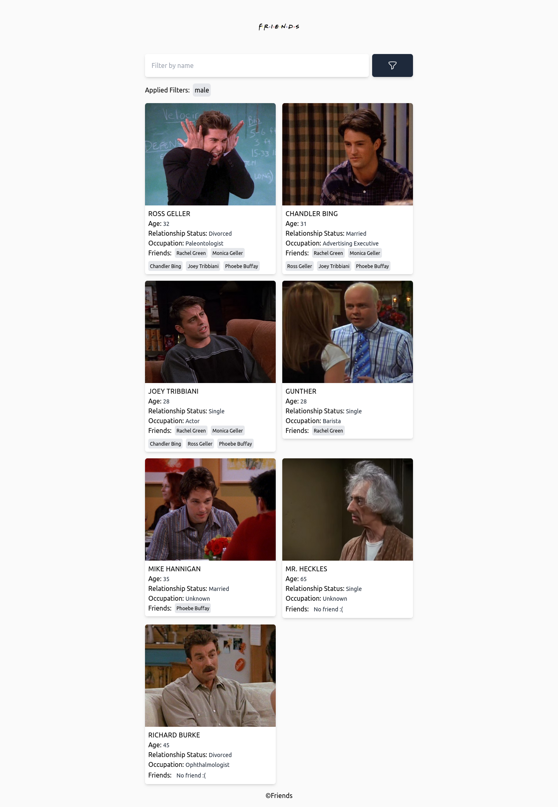

# Friends App

Friends App is a web application that allows users to search for a character in the friends series and see details about the character. User can search with name, and sort names, and filter them by gender to find the characters.

## Table of contents

- [Overview](#overview)
  - [Screenshot](#screenshot)
  - [Links](#links)
- [My process](#my-process)
  - [Built with](#built-with)
  - [What I learned](#what-i-learned)
  - [Useful resources](#useful-resources)

## Overview

### Screenshot

### Links

- Live Site URL: [https://friends-app-rahul.vercel.app/](https://friends-app-rahul.vercel.app/)

## My process

### Built with

- Angular - JavaScript Framework
- Tailwind CSS - For styles

### What I learned

- Routing in Angular

### Useful resources

- [Tailwind CSS](https://tailwindcss.com/)
